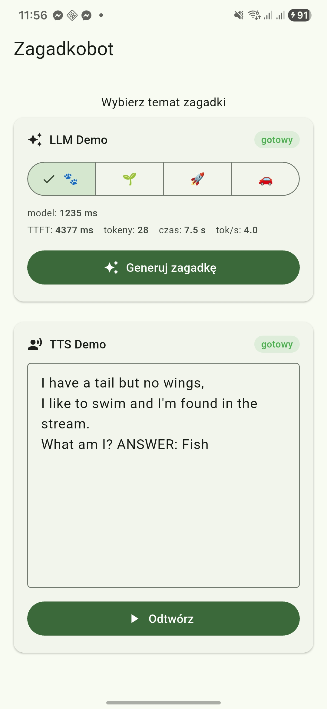

# 📓 Notatnik Projektu — Zagadkobot - 2026-03-11

## 🎯 Cele i Kamienie Milowe

- **Cel główny:** Aplikacja mobilna dla dzieci generująca zagadki w języku polskim, działająca w pełni offline z lokalnym LLM. Chcę dowiedzieć się, czy uruchomienie modelu lokalnie na mobile jest w ogóle możliwe.

---

## 🛠️ Dobór Technologii

### Stack (propozycja)

| Warstwa | Technologia | Uwagi |
|--------|-------------|-------|
| Framework | Flutter | Natywne FFI do C/C++, jeden codebase |
| State management | Riverpod 2 | Compile-safe, autodispose |
| LLM | Bielik v3 1.5B → 4.5B / Qwen 2.5 0.5B → 1.5B → 3.0B | Bielik preferowany — polski LLM, prawdopodobnie będzie lepiej sobie radził z zagadkami w języku polskim |
| LLM runtime | llama.cpp via Platform Channel (Kotlin) | Najszybszy inference na ARM, obsługa GGUF |

### Pipeline (na potrzeby tego testu)
Kliknięcie kafelka → LLM generuje zagadkę (stream tokenów) → wyświetlić w input → Możliwość TTS

---

## 📅 Dziennik

### 11.03.2026

**Co robiłem:** Sprawdzałem czy uruchomienie modelu lokalnie na mobile jest w ogóle możliwe. Stack: Flutter + llama.cpp. Testowałem kolejno cztery modele:
- `Qwen2.5-0.5B-Instruct-Q4_K_M` — bredził, ale response natychmiastowy
- `Bielik-1.5B-v3.0-Instruct.Q4_K_M` — pomimo prób w strukturze promptu nie był w stanie wygenerować pełnej odpowiedzi trzymającej format
- `qwen2.5-1.5b-instruct-q4_k_m` — test nadal słaby i nielogiczny
- `qwen2.5-3b-instruct-q4_k_m` — pierwszy który zaczął dawać sensowne odpowiedzi (w języku angielskim) i trzymać się formatu

**Co zauważyłem:** Modele poniżej 3B są zbyt małe. Bielik ma problemy z generowaniem odpowiedzi. Qwen tymczasowo lepszym wyborem.

**Wniosek:** Lokalny LLM na mobile jest możliwy, próg użyteczności od ~3B.

**Następny krok:** Przetestować Qwen3.5-4B + próba fine-tuningu.

---

## 🔥 Problemy i Rozwiązania

### 11.03.2026 — Bielik zawiesza się zamiast generować odpowiedź

**Problem:** `Bielik-1.5B-v3.0-Instruct.Q4_K_M` ładuje się, ale nie generuje odpowiedzi — długo "myśli" i się zawiesza.

**Rozwiązanie:** Tymczasowe zastąpienie przez Qwen. Bielik do zbadania — docelowo preferowany (natywny polski tokenizer APT4).

**Wniosek:** Nie każdy model GGUF działa stabilnie przez llama.cpp na mobile.

---

### 10.03.2026 — sherpa-onnx nie działa na mobile

**Problem:** Nie udało się uruchomić sherpa-onnx (chciałem sprawdzić silnik TTS z Piperem) na urządzeniu mobilnym.

**Rozwiązanie:** Zastąpienie przez `flutter_tts` — prostsze w integracji, wystarczające na ten etap.

**Wniosek:** Priorytet to LLM, nie TTS. sherpa-onnx wraca jako zadanie gdy LLM będzie stabilny. flutter_tts jako placeholder.

---

## 📊 Wyniki i Metryki

- ✅ Lokalny LLM na mobile działa (Flutter + llama.cpp)
- ✅ Pierwsza sensowna odpowiedź: `qwen2.5-3b-instruct-q4_k_m`
- ✅ TTS działa przez flutter_tts (placeholder)
- ❌ Modele <3B — nieużyteczne
- ❌ Bielik 1.5B — problem ze stabilnością (do zbadania)
- ❌ sherpa-onnx — problem z uruchomieniem na mobile (odkładam)

---

## 🏁 Case Study — Podsumowanie

Cel POC był prosty: sprawdzić, czy lokalny LLM na telefonie Android w ogóle może działać. Odpowiedź brzmi **tak** — ale z zastrzeżeniami.

### Wyniki ze screenshota (Qwen2.5-3B, Samsung Galaxy S25+)

| Metryka | Wartość |
|---|---|
| Czas ładowania modelu | **1235 ms** |
| TTFT (czas do pierwszego tokena) | **4377 ms** |
| Łączny czas generowania | **7.5 s** |
| Liczba tokenów | **28** |
| Przepustowość | **4.0 tok/s** |

### Obserwacje

**Co działa:**
Model generuje zagadkę, trzyma format, TTS odczytuje wynik. Cały pipeline — od kliknięcia do głosu — działa offline, bez internetu.

**Co nie działa jeszcze:**
Zagadki generowane są jeszcze po angielsku. System prompt wymaga poprawy — model musi bezwzględnie odpowiadać po polsku, ale to wpływa na sens zagadki. Bielik pewnie byłby tu lepszym wyborem, ale ma problem ze stabilnością.

### Wniosek

POC zaliczony. Następny krok: Qwen2.5-4B lub Bielik 4.5B — wyższy limit tokenów, dłuższa zagadka, pełny język polski.

