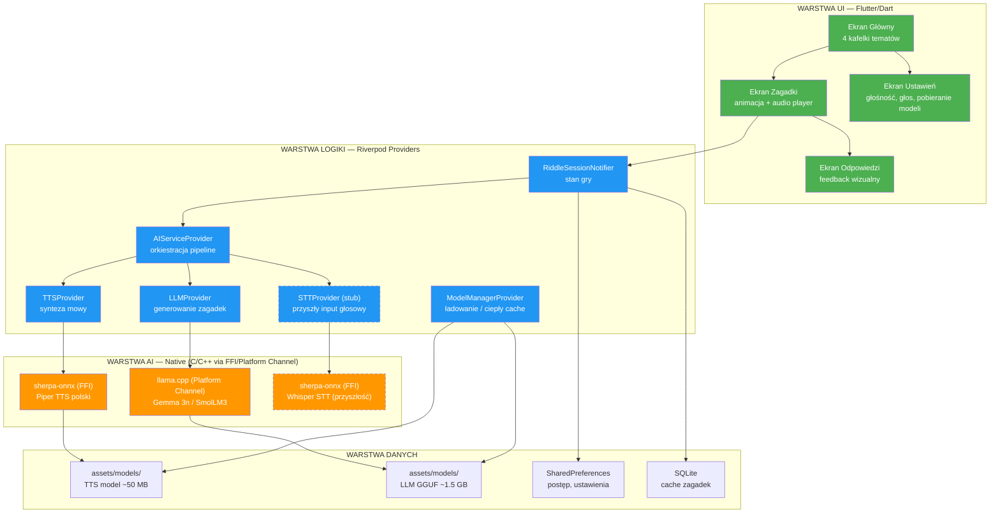
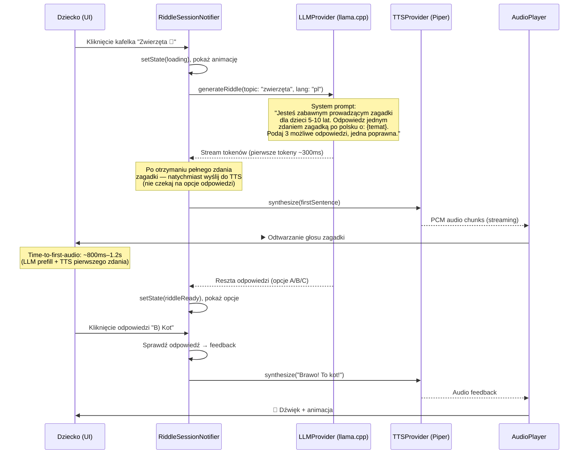
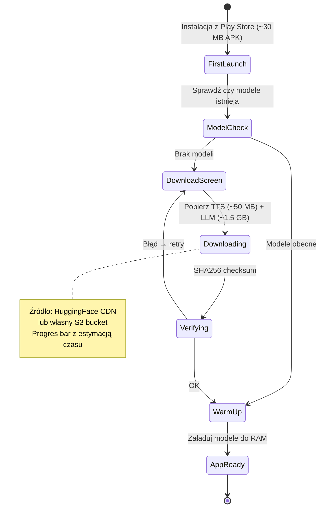

# Architektura Aplikacji „Zagadkownik" — Zagadki dla Dzieci

## 1. Podsumowanie Decyzji Technicznych

| Decyzja | Wybór | Uzasadnienie |
|---------|-------|-------------|
| **Framework** | **Flutter** | Natywny FFI do C/C++ (sherpa-onnx, llama.cpp), jeden codebase, wydajny rendering UI, dojrzały pakiet `sherpa_onnx` na pub.dev |
| **State management** | **Riverpod 2** | Compile-safe, testable, autodispose — idealny do zarządzania ciężkimi zasobami AI |
| **TTS engine** | **Piper via sherpa-onnx** | Model VITS/ONNX, polski głos (~30–60 MB), latencja <200 ms na midrange |
| **LLM on-device** | **Gemma 3n 2B (Q4_K_M)** lub **SmolLM3 3B (Q4)** | ~1.5 GB RAM, dobra jakość polskiego, GGUF via llama.cpp |
| **LLM runtime** | **llama.cpp** (via platform channel Kotlin) | Najszybszy inference na ARM, obsługa GGUF, GPU delegate Vulkan |
| **STT (przyszłość)** | **sherpa-onnx** (Whisper Small / Zipformer) | Ten sam runtime co TTS, jeden natywny bridge |
| **Min Android** | API 26 (Android 8.0) | Pokrycie ~95% urządzeń, wymagane dla NNAPI |

---

## 2. Diagram Architektury Warstwowej



---

## 3. Sekwencja Główna — Od Kliknięcia Kafelka do Odtworzenia Głosu



---

## 4. Struktura Projektu

```
zagadkownik/
├── android/
│   ├── app/
│   │   ├── src/main/
│   │   │   ├── kotlin/.../
│   │   │   │   ├── MainActivity.kt
│   │   │   │   ├── LlamaCppBridge.kt        # Platform channel → llama.cpp
│   │   │   │   └── ModelDownloadService.kt   # Background download
│   │   │   ├── jniLibs/                      # llama.cpp .so per ABI
│   │   │   └── AndroidManifest.xml
│   │   └── build.gradle.kts
│   └── build.gradle.kts
│
├── lib/
│   ├── main.dart
│   ├── app.dart                              # MaterialApp, routing
│   │
│   ├── core/
│   │   ├── constants.dart                    # Prompts, limity, ścieżki modeli
│   │   ├── theme.dart                        # Kolory, typo (duże, czytelne)
│   │   └── logger.dart
│   │
│   ├── features/
│   │   ├── home/
│   │   │   ├── home_screen.dart              # 4 kafelki tematów
│   │   │   └── widgets/
│   │   │       └── topic_tile.dart           # Kafelek z emoji + nazwa
│   │   │
│   │   ├── riddle/
│   │   │   ├── riddle_screen.dart            # Wyświetlanie zagadki + opcje
│   │   │   ├── riddle_controller.g.dart      # Riverpod codegen
│   │   │   └── widgets/
│   │   │       ├── answer_button.dart
│   │   │       ├── riddle_animation.dart
│   │   │       └── audio_wave_indicator.dart
│   │   │
│   │   └── settings/
│   │       ├── settings_screen.dart
│   │       └── model_download_screen.dart    # Postęp pobierania modeli
│   │
│   ├── services/
│   │   ├── ai/
│   │   │   ├── llm_service.dart              # Abstrakcja LLM
│   │   │   ├── llm_service_llamacpp.dart     # Impl. via platform channel
│   │   │   ├── tts_service.dart              # Abstrakcja TTS
│   │   │   ├── tts_service_sherpa.dart       # Impl. via sherpa_onnx FFI
│   │   │   ├── stt_service.dart              # Abstrakcja STT (interface)
│   │   │   └── ai_pipeline.dart              # Orkiestracja: LLM → TTS → Audio
│   │   │
│   │   ├── audio/
│   │   │   ├── audio_player_service.dart     # Odtwarzanie PCM/WAV
│   │   │   └── audio_recorder_service.dart   # Przyszłość: STT input
│   │   │
│   │   └── storage/
│   │       ├── model_manager.dart            # Pobieranie, cache, wersje modeli
│   │       ├── riddle_cache.dart             # SQLite cache zagadek
│   │       └── preferences_service.dart
│   │
│   ├── providers/
│   │   ├── ai_providers.dart                 # Riverpod: LLM, TTS, pipeline
│   │   ├── session_providers.dart            # Stan gry, historia
│   │   └── settings_providers.dart
│   │
│   └── models/
│       ├── riddle.dart                       # Zagadka + opcje + odpowiedź
│       ├── topic.dart                        # Enum tematów z emoji
│       └── app_settings.dart
│
├── assets/
│   ├── models/                               # Gitignore! Pobierane po instalacji
│   │   ├── tts/                              # piper-pl-gosia-medium.onnx (~50 MB)
│   │   └── llm/                              # gemma-3n-2b-Q4_K_M.gguf (~1.5 GB)
│   ├── sounds/                               # Efekty dźwiękowe (brawo, próbuj dalej)
│   └── images/                               # Emoji/ikony tematów
│
├── test/
│   ├── services/ai/                          # Testy pipeline
│   ├── features/riddle/                      # Widget testy
│   └── integration/                          # Integration testy
│
└── pubspec.yaml
```

---

## 5. Zarządzanie Stanem — Riverpod 2

### Dlaczego Riverpod (nie Bloc, nie Provider)?

| Kryterium | Provider | Bloc | **Riverpod** |
|-----------|----------|------|-------------|
| Zarządzanie ciężkimi zasobami (modele AI) | Słabe (brak autodispose) | Manualne | **autodispose + keepAlive** |
| Testabilność | Wymaga widget tree | Dobra | **Najlepsza (ProviderContainer)** |
| Compile-time safety | Brak | Brak | **Tak (codegen)** |
| Stream + async | Ograniczone | Event-driven | **Natywne AsyncNotifier** |
| Kombajnowanie providerów | Trudne | Trudne | **ref.watch / ref.listen** |

### Kluczowe Providery

```dart
// === Model Lifecycle Provider ===
// Modele trzymane w pamięci dopóki aplikacja żyje
@Riverpod(keepAlive: true)
class ModelManager extends _$ModelManager {
  @override
  Future<ModelState> build() async {
    // Cold start: załaduj TTS (~200ms), LLM warm-up (~1-2s)
    final tts = await ref.read(ttsServiceProvider).initialize();
    final llm = await ref.read(llmServiceProvider).initialize();
    return ModelState(ttsReady: tts, llmReady: llm);
  }
}

// === Riddle Session — autodispose per ekran ===
@riverpod
class RiddleSession extends _$RiddleSession {
  @override
  RiddleState build(Topic topic) => RiddleState.initial(topic);

  Future<void> generateRiddle() async {
    state = state.copyWith(status: RiddleStatus.loading);
    final pipeline = ref.read(aiPipelineProvider);
    
    await pipeline.generateAndSpeak(
      topic: state.topic,
      onRiddleReady: (riddle) {
        state = state.copyWith(riddle: riddle, status: RiddleStatus.ready);
      },
      onAudioStart: () {
        state = state.copyWith(isPlaying: true);
      },
    );
  }

  void submitAnswer(int index) {
    final correct = index == state.riddle!.correctIndex;
    state = state.copyWith(
      selectedAnswer: index,
      status: correct ? RiddleStatus.correct : RiddleStatus.wrong,
    );
    // Odtwórz feedback audio
    ref.read(aiPipelineProvider).speakFeedback(correct);
  }
}
```

---

## 6. AI Pipeline — Szczegóły Implementacji

### 6.1 LLM: llama.cpp via Platform Channel

**Dlaczego Platform Channel zamiast FFI?**  
llama.cpp wymaga zarządzania wątkami i pamięcią po stronie natywnej. Kotlin/JNI pozwala na bezpieczniejszą integrację z Android lifecycle i lepszą kontrolę nad GPU delegate (Vulkan).

```
┌─────────────────────────────────────────────────┐
│  Dart (Flutter)                                 │
│  llm_service_llamacpp.dart                      │
│  MethodChannel('com.zagadkownik/llama')          │
│    → invokeMethod('generate', {prompt, params})  │
│    ← EventChannel stream tokenów                 │
└──────────────────────┬──────────────────────────┘
                       │ Platform Channel
┌──────────────────────▼──────────────────────────┐
│  Kotlin (Android)                               │
│  LlamaCppBridge.kt                              │
│    → JNI → libllama.so                           │
│    → Osobny wątek (Coroutine)                    │
│    → Token callback → EventChannel sink          │
└─────────────────────────────────────────────────┘
```

**System Prompt (zakodowany w aplikacji):**

```
Jesteś wesołym prowadzącym zagadki dla dzieci w wieku 5-10 lat.
Zasady:
1. Wymyśl krótką zagadkę (1-2 zdania) na temat: {TEMAT}
2. Podaj dokładnie 3 odpowiedzi oznaczone A), B), C)
3. Dokładnie jedna odpowiedź jest poprawna
4. Odpowiedz TYLKO w formacie:
   ZAGADKA: [treść zagadki]
   A) [opcja]
   B) [opcja]  
   C) [opcja]
   POPRAWNA: [A/B/C]
5. Użyj prostego języka polskiego, bądź zabawny
```

**Parametry inference:**

```
temperature: 0.8      # Kreatywność, ale nie za dużo
top_p: 0.9
top_k: 40
max_tokens: 150        # Zagadka jest krótka
repeat_penalty: 1.1    # Unikaj powtórzeń
n_threads: 4           # Midrange ma 4-8 rdzeni big
n_gpu_layers: 0        # MVP: CPU-only, potem Vulkan
```

### 6.2 TTS: Piper via sherpa-onnx FFI

**Model polski:** `piper-pl-gosia-medium.onnx` (~50 MB, 22.05 kHz)  
Alternatywy: `pl-meski`, `pl-darkman` (głosy z HuggingFace WitoldG)

```dart
// tts_service_sherpa.dart
class TtsServiceSherpa implements TtsService {
  late final sherpa.OfflineTts _tts;

  @override
  Future<void> initialize() async {
    final modelPath = await _modelManager.getModelPath('tts/piper-pl');
    _tts = sherpa.OfflineTts(
      model: sherpa.OfflineTtsModelConfig(
        vits: sherpa.OfflineTtsVitsModelConfig(
          model: '$modelPath/pl-gosia-medium.onnx',
          tokens: '$modelPath/tokens.txt',
          dataDir: '$modelPath/espeak-ng-data',
        ),
      ),
      numThreads: 2,
      maxNumSentences: 1,  // Streaming: jedno zdanie na raz
    );
  }

  @override
  Stream<Float32List> synthesizeStream(String text) async* {
    // Podziel tekst na zdania dla pseudo-streamingu
    final sentences = _splitIntoSentences(text);
    for (final sentence in sentences) {
      final audio = _tts.generate(text: sentence, sid: 0, speed: 0.9);
      yield audio.samples;  // PCM Float32
    }
  }
}
```

### 6.3 Orkiestracja Pipeline (klucz do <1.5s latencji)

```dart
// ai_pipeline.dart — KLUCZOWA OPTYMALIZACJA
class AIPipeline {
  Future<void> generateAndSpeak({
    required Topic topic,
    required Function(Riddle) onRiddleReady,
    required VoidCallback onAudioStart,
  }) async {
    final buffer = StringBuffer();
    String? firstSentence;

    // 1. Rozpocznij streaming LLM
    await for (final token in _llmService.generateStream(
      prompt: _buildPrompt(topic),
    )) {
      buffer.write(token);

      // 2. PIPELINE OVERLAP: gdy mamy pierwsze pełne zdanie →
      //    natychmiast wyślij do TTS (nie czekaj na resztę!)
      if (firstSentence == null && _hasCompleteSentence(buffer.toString())) {
        firstSentence = _extractFirstSentence(buffer.toString());
        
        // Uruchom TTS RÓWNOLEGLE z dalszym generowaniem LLM
        unawaited(_speakSentence(firstSentence).then((_) {
          onAudioStart();
        }));
      }
    }

    // 3. Parsuj pełną odpowiedź → zagadka + opcje
    final riddle = _parseRiddleResponse(buffer.toString());
    onRiddleReady(riddle);
  }
}
```

**Budżet latencji (target <1.5s time-to-first-audio):**

```
┌─────────────────────────────────────────────────────────────┐
│ Faza                         │ Czas      │ Kumulatywnie     │
├─────────────────────────────────────────────────────────────┤
│ LLM prefill (prompt ~80 tok) │ 200-400ms │ 400ms            │
│ LLM decode do "." (20-30 tok)│ 300-500ms │ 900ms            │
│ TTS synth 1. zdania (~15 sł) │ 150-300ms │ 1200ms           │
│ Audio buffer start            │ 50ms      │ 1250ms           │
│                               │           │                  │
│ BUFOR BEZPIECZEŃSTWA          │ 250ms     │ 1500ms ✅        │
└─────────────────────────────────────────────────────────────┘
```

---

## 7. Zarządzanie Modelami — Cold Start vs Warm

### 7.1 Strategia Dystrybucji Modeli

**Problem:** LLM (~1.5 GB) + TTS (~50 MB) = nie mieści się w APK (limit Play Store ~200 MB + expansion files).

**Rozwiązanie: Download-on-first-run**



### 7.2 Lifecycle Modeli w Pamięci

```
┌────────────────────────────────────────────────────────────┐
│                    COLD START (~3-5s)                       │
│                                                            │
│  App Launch → Splash Screen                                │
│    ├── TTS model load: mmap ONNX → ONNX Runtime (~300ms)  │
│    ├── LLM model load: mmap GGUF → llama.cpp (~2-4s)      │
│    │   └── First-time: optimize weight layout + cache      │
│    └── → Home Screen gotowy                                │
│                                                            │
├────────────────────────────────────────────────────────────┤
│                    WARM STATE                               │
│                                                            │
│  Modele trzymane w pamięci (Riverpod keepAlive: true)      │
│  ├── TTS: ~100 MB RAM (ONNX Runtime session)              │
│  ├── LLM: ~1.8 GB RAM (mmap, OS może evict pages)         │
│  └── Total: ~1.9 GB → wymaga min. 4 GB RAM na urządzeniu  │
│                                                            │
├────────────────────────────────────────────────────────────┤
│                    BACKGROUND / LOW MEMORY                  │
│                                                            │
│  Android LowMemory callback:                               │
│    ├── Priorytet 1: Zwolnij LLM (największy)              │
│    ├── Priorytet 2: TTS zostaje (mały, szybki reload)     │
│    └── Przy powrocie: re-load LLM (~2-4s, pokaż spinner)  │
└────────────────────────────────────────────────────────────┘
```

---

## 8. Streaming Audio — TTS do Głośnika

```dart
// audio_player_service.dart
class AudioPlayerService {
  late final AudioTrack _track;  // Android AudioTrack via platform channel
  
  // Alternatywa: flutter_sound lub just_audio z custom source
  
  Future<void> playPCMStream(Stream<Float32List> audioStream) async {
    // Inicjalizuj AudioTrack: 22050 Hz, mono, Float32
    await _initTrack(sampleRate: 22050, channels: 1);
    
    await for (final chunk in audioStream) {
      // Konwersja Float32 → Int16 PCM dla AudioTrack
      final int16Data = _float32ToInt16(chunk);
      await _track.write(int16Data);
      
      // AudioTrack automatycznie buforuje i odtwarza
      // Minimalny latency: ~50ms z AUDIO_MODE_LOW_LATENCY
    }
    
    await _track.flush();
  }
  
  Int16List _float32ToInt16(Float32List float32) {
    final int16 = Int16List(float32.length);
    for (var i = 0; i < float32.length; i++) {
      int16[i] = (float32[i] * 32767).round().clamp(-32768, 32767);
    }
    return int16;
  }
}
```

**Strategia buforowania:**
- Piper generuje audio per zdanie (~0.5-2s audio na zdanie)
- Każde zdanie to jeden chunk PCM
- AudioTrack z trybem `PERFORMANCE_MODE_LOW_LATENCY`
- Double-buffering: podczas odtwarzania chunk N, TTS generuje chunk N+1

---

## 9. Przygotowanie pod STT (Rozszerzalność)

### Wzorzec Interface Segregation

```dart
// === Obecny kontrakt (MVP) ===
abstract class InputService {
  Stream<Topic> get topicSelections;  // MVP: z kafelków UI
}

// === Przyszły kontrakt (v2 ze STT) ===
abstract class VoiceInputService extends InputService {
  Future<void> startListening();
  Future<void> stopListening();
  Stream<String> get transcription;   // "Chcę zagadkę o kotach"
  Stream<Topic> get topicSelections;  // Mapowanie: NLU → Topic
}

// === Implementacja stub (MVP) ===
class TapInputService implements InputService {
  final _controller = StreamController<Topic>();
  
  void selectTopic(Topic topic) => _controller.add(topic);
  
  @override
  Stream<Topic> get topicSelections => _controller.stream;
}

// === Przyszła implementacja (v2) ===
class SherpaSTTInputService implements VoiceInputService {
  // sherpa-onnx Whisper Small PL (~200 MB)
  // + prosty NLU: keyword matching "kot" → Topic.animals
  // Sherpa ma już Flutter examples dla streaming ASR
}
```

### Co trzeba przygotować w MVP:

1. **`RECORD_AUDIO` permission** — dodaj do Manifestu już teraz (nie pytaj o nią, ale zadeklaruj)
2. **Abstrakcja `InputService`** — kafelki to jedna implementacja, STT to druga
3. **Routing** — ekran główny powinien mieć slot na przycisk mikrofonu (ukryty w MVP)
4. **sherpa-onnx dependency** — jest już w projekcie dla TTS, STT to dodanie modelu Whisper

---

## 10. Publikacja w Google Play

### 10.1 Checklist Techniczny

```
PRE-RELEASE:
├── Signing
│   ├── Generuj upload key: keytool -genkey -v -keystore upload.jks
│   ├── Skonfiguruj key.properties (NIE commituj do repo!)
│   ├── Włącz Play App Signing (Google zarządza release key)
│   └── build.gradle: signingConfigs → release
│
├── Build
│   ├── flutter build appbundle --release
│   ├── AAB (nie APK!) — wymagane przez Play Store
│   ├── Proguard / R8: zachowaj JNI klasy llama.cpp
│   │   └── -keep class com.zagadkownik.llama.** { *; }
│   ├── Split APKs per ABI: arm64-v8a (priorytet), armeabi-v7a
│   └── Asset Delivery: Large models via Play Asset Delivery (PAD)
│       ├── install-time: TTS model (~50 MB)
│       └── on-demand: LLM model (~1.5 GB) — Fast-follow delivery
│
├── Permissions (AndroidManifest.xml)
│   ├── INTERNET — pobieranie modeli (jeśli nie PAD)
│   ├── RECORD_AUDIO — zadeklaruj dla przyszłego STT
│   │   └── W MVP: nie pytaj runtime, tylko deklaracja w manifeście
│   ├── FOREGROUND_SERVICE — pobieranie w tle
│   └── NIE potrzebujesz: WRITE_EXTERNAL_STORAGE (scoped storage)
│
├── Play Asset Delivery (kluczowe!)
│   ├── base APK: <150 MB (Flutter app + TTS model)
│   ├── on-demand pack: LLM model ~1.5 GB
│   │   └── Pobierane po instalacji, z progress barem
│   └── Konfiguracja w build.gradle → assetPacks
│
└── Store Listing
    ├── Target audience: dzieci → WYMAGA Family Policy compliance
    ├── Content rating: IARC → Everyone
    ├── Privacy policy: WYMAGANA (brak zbierania danych)
    ├── Data safety form: "No data collected"
    ├── Teacher Approved badge: opcjonalne, ale wartościowe
    └── Designed for Families: tak → dodatkowe wymagania UI
```

### 10.2 Families Policy — Krytyczne Wymagania

Aplikacja kierowana do dzieci musi spełniać rygorystyczne wymagania Google:

- **Brak reklam** z sieci reklamowych niecertyfikowanych przez Google
- **Brak zbierania danych** (PII) bez zgody rodzica (COPPA)
- **Login**: jeśli wymagany → weryfikacja wieku
- **Content**: brak przemocy, treści nieodpowiednich
- **Privacy Policy**: musi jasno określać brak zbierania danych
- **Offline-first**: nasz model spełnia to idealnie (brak transmisji danych)

---

## 11. Wąskie Gardła i Mitygacja

### 11.1 Tabela Ryzyk

| # | Ryzyko | Prawdopodobieństwo | Wpływ | Mitygacja |
|---|--------|-------------------|-------|-----------|
| 1 | **LLM zbyt wolny na low-end** | Wysokie | Krytyczny | Cache zagadek w SQLite; prefetch przy starcie; fallback na preset zagadki |
| 2 | **Za mało RAM** (urządzenia <4GB) | Średnie | Krytyczny | Graceful degradation: użyj mniejszego modelu (Qwen 0.5B) lub tylko cache |
| 3 | **Jakość polskiego w LLM** | Średnie | Wysoki | Testuj wiele modeli; fine-tune na zbiorze polskich zagadek; fallback prompty |
| 4 | **TTS brzmi nienaturalnie** | Niskie | Średni | Testuj głosy Piper PL; dopasuj speed=0.9 dla dzieci; dodaj pauzy |
| 5 | **Model download failure** | Średnie | Wysoki | Resume downloads; chunk downloading; SHA256 verify; retry z exponential backoff |
| 6 | **APK za duży** | Niskie | Średni | Play Asset Delivery; modele on-demand; split per ABI |
| 7 | **LLM generuje nieodpowiednie treści** | Niskie | Krytyczny | Ścisły system prompt; whitelist tematów; filtr output (regex na wulgaryzmy) |
| 8 | **Cold start >5s** | Średnie | Średni | Splash screen z animacją; ładuj TTS najpierw (mały, szybki); lazy load LLM |
| 9 | **Battery drain** | Średnie | Średni | Inference tylko na żądanie; zwalniaj LLM po 5 min nieaktywności |
| 10 | **Google Play rejection (Family Policy)** | Średnie | Krytyczny | Audyt przed submitem; brak internetu w trakcie gry; privacy policy |

### 11.2 Strategia Fallback — Zagadki Offline (bez LLM)

Na wypadek urządzeń, które nie obsłużą LLM, przygotuj ~200 zagadek wbudowanych w aplikację:

```dart
// riddle_cache.dart
class RiddleCache {
  // Priorytet źródeł zagadek:
  // 1. LLM on-device (jeśli model załadowany)
  // 2. Wcześniej wygenerowane zagadki (SQLite cache)
  // 3. Predefiniowane zagadki (assets/riddles_pl.json)
  
  Future<Riddle> getRiddle(Topic topic) async {
    if (await _llmAvailable()) {
      return _generateFresh(topic);
    }
    
    final cached = await _db.getUnusedRiddle(topic);
    if (cached != null) return cached;
    
    return _getPresetRiddle(topic);  // Zawsze działa, brak AI
  }
}
```

---

## 12. Budżet Pamięci i Wymagania Sprzętowe

```
┌─────────────────────────────────────────────────────────────┐
│              BUDŻET RAM — Target Device                     │
│              (midrange Android, 6 GB RAM)                   │
├─────────────────────────────────────────────────────────────┤
│ Komponent                        │ RAM          │ Dysk      │
├──────────────────────────────────┼──────────────┼───────────┤
│ Flutter engine + UI              │ ~80 MB       │ —         │
│ Piper TTS (ONNX Runtime)        │ ~100 MB      │ ~50 MB    │
│ LLM Gemma 3n 2B Q4 (mmap)      │ ~1.5-1.8 GB* │ ~1.5 GB   │
│ Audio buffers                    │ ~10 MB       │ —         │
│ SQLite cache                     │ ~5 MB        │ ~10 MB    │
│ System overhead                  │ ~200 MB      │ —         │
├──────────────────────────────────┼──────────────┼───────────┤
│ RAZEM                            │ ~2.0 GB      │ ~1.6 GB   │
│ * mmap = OS ładuje tylko potrzebne strony              │
└─────────────────────────────────────────────────────────────┘

Minimum: 4 GB RAM (z mmap + swap) → ~80% urządzeń Android
Rekomendowane: 6 GB RAM → ~60% urządzeń Android
Dysk: ~2 GB wolnego po instalacji
```

---

## 13. Roadmap MVP → v2

```
MVP (miesiąc 1-2):
├── 4 tematy zagadek (kafelki)
├── LLM on-device → generowanie zagadek PL
├── TTS Piper → głosowa odpowiedź
├── Fallback: preset zagadki (brak AI na słabych urządzeniach)
├── Download manager modeli
└── Publikacja Google Play (Family)

v1.1 (miesiąc 3):
├── Więcej tematów (8-12)
├── System punktów / gwiazdek
├── Animacje i dźwięki nagród
├── Cache inteligentny (prefetch zagadek)
└── Optymalizacja: Vulkan GPU dla LLM

v2.0 (miesiąc 4-5):
├── STT: dziecko mówi jaki chce temat
├── Whisper Small PL via sherpa-onnx
├── Prosty NLU: mapowanie mowy → temat
├── Tryb konwersacyjny (follow-up pytania)
└── Personalizacja poziomu trudności
```
